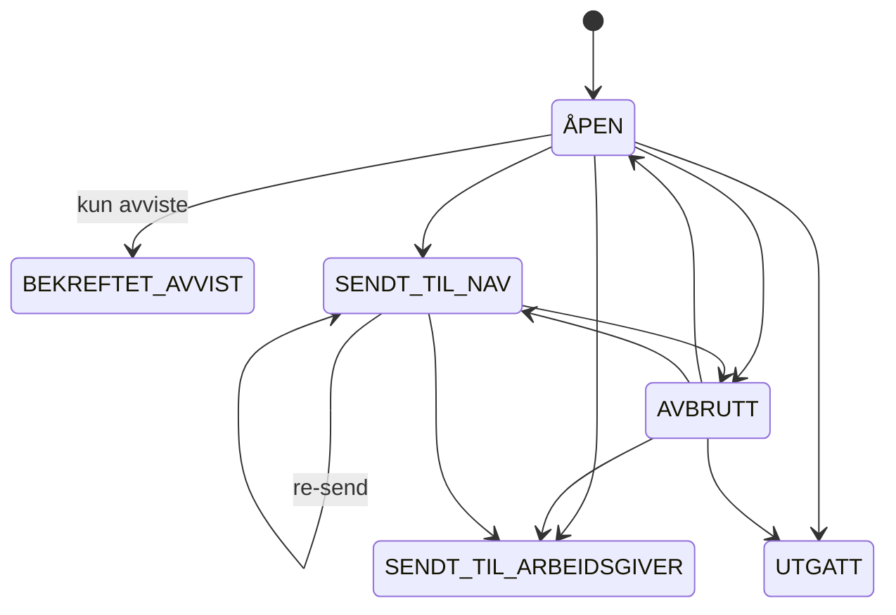

# flex-sykmeldinger-backend

Backend for håndtering av sykmeldinger i Flex. Tjenesten mottar sykmeldinger fra Kafka, lagrer dem og eksponerer API-er mot innbyggerflaten.

## Dataflyt

```
tsm.sykmeldinger (Kafka)
        │
        ▼
  Ny sykmelding:
    - Lagres med hendelse ÅPEN
    - Arbeidsforhold synkroniseres fra Aareg
    - Brukernotifikasjon sendes
  Oppdatert sykmelding: grunnlag/validering oppdateres
  Tombstone (null): sykmelding slettes
        │
        ▼
  Bruker handler via API ditt-sykefravaer (sykmeldinger):
    - Send   → SENDT_TIL_ARBEIDSGIVER (arbeidstaker/fisker på hyre)
               SENDT_TIL_NAV (øvrige arbeidssituasjoner)
    - Avbryt → AVBRUTT
    - Bekreft avvist → BEKREFTET_AVVIST
        │
        ▼
  Ny hendelse publiseres på:
  teamsykmelding.sykmeldingstatus-leesah (Kafka)
        │
        ▼
  syfosmregister leser og videresender til sykepengesoknad-backend
```

**Andre Kafka-topics:**

| Topic                                       | Retning | Formål                          |
|---------------------------------------------|---------|---------------------------------|
| `teamsykmelding.syfo-narmesteleder-leesah`  | inn     | Oppdaterer nærmeste leder       |
| `arbeidsforhold.aapen-aareg-arbeidsforholdhendelse-v1` | inn | Oppdaterer arbeidsforhold fra Aareg |
| `teamsykmelding.sykmeldingnotifikasjon`     | ut      | Brukernotifikasjoner            |

## Statusoverganger



> **Merk:** På Kafka-topicet `sykmeldingstatus-leesah` brukes eldre statusnavn:
> `SENDT_TIL_ARBEIDSGIVER` → `SENDT` · `SENDT_TIL_NAV` → `BEKREFTET` · `BEKREFTET_AVVIST` → `BEKREFTET`

- Egenmeldte sykmeldinger kan ikke endre status
- Avviste sykmeldinger kan kun gå til `BEKREFTET_AVVIST`
- `UTGATT` er en terminal status (settes eksternt via `sykmeldingstatus-leesah`)


## Henvendelser

Spørsmål knyttet til koden eller prosjektet kan stilles til flex@nav.no

## For NAV-ansatte

Interne henvendelser kan sendes via Slack i kanalen #flex.
